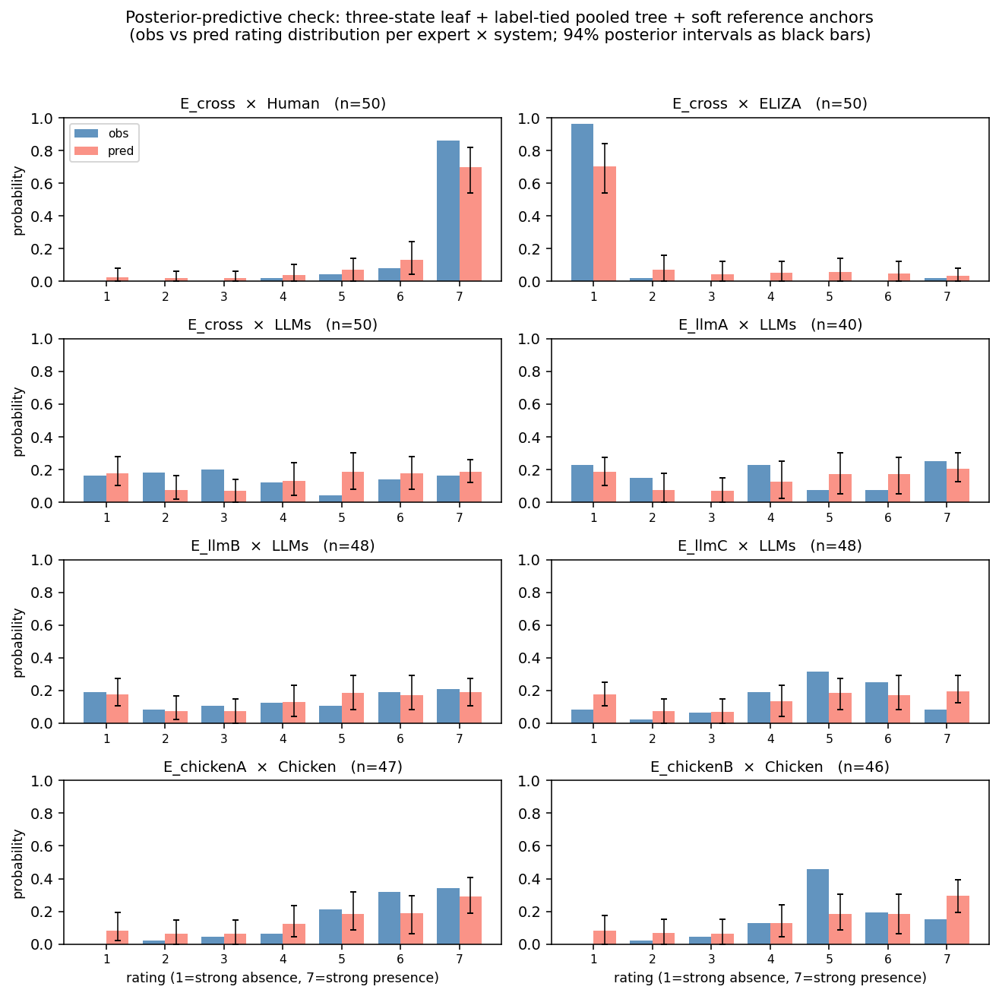

# Apr 24, 2026

**Headline:** Three days on the GWT ordinal DCM this week — I've now got a clear picture of what more modelling can and cannot fix on the current data. Two observation-layer variants resolved (three-state leaf kept as a library member, per-expert sharpness `σ_e` rejected as weakly identified), one tree-prior iteration gave the leading candidate model `pool_3s`, and today's diagnostic localises the remaining reference-cell misfit: **Human is tree-limited (addressable), ELIZA has a ~0.08 irreducible emission-ceiling residual under shared cutpoints and single-cross-system-rater coverage**.

**One-figure summary (all 8 rater × system cells with data, under `pool_3s` + soft anchors):**

Top row is the two reference cells where `E_cross` is the only rater. Everything else (LLM raters, chicken raters, cross-rater on LLMs) fits well. The misfit is concentrated in the top row, and today's structural diagnostic attributes it as described in the headline.

---

## Key questions

(Carrying over from last week — same questions, new context, since I was out sick.)

1. **End-deliverable picture, especially on modelling.** Can we settle on a realistic stopping point for the current data so it's easy to pick back up when new data arrives? My current best guess: library = {binary baseline, three-state leaf, `pool_3s`} + honest-limits section on the ELIZA residual. Happy to have that shaped.
2. **Arvo and Matilda especially — anything in the data-generating process that feels off?** I think I've mostly exhausted what modelling can extract from the current ratings without invalidating identification.
3. **(new, for Arvo) ELIZA residual framing.** Today I proved the `E_cross × ELIZA` bottom-tail residual has a ~0.08 component *no tree-prior variant can close* under shared cutpoints — it requires $\kappa_0 > 1.75$ but the shared-cutpoint posterior tops out around 1.69 (constrained by non-ELIZA raters' bottom-category usage). Do we report this as honest emission/identifiability misspecification, or add a narrowly regularised `E_cross`-only outer-cutpoint shift as a sensitivity? I lean "report honestly".
4. **(new, for group) Backend decision.** Proper partial-pooling on tree priors compiles in >60 min on pytensor C-backend but should work cleanly on JAX or numba. Not a one-person decision.
5. **(possibly for Matilda) Weak-undermining "resolution" under pooling is a shared-parameter artefact.** The `weak undermining + neutral` label's posterior $\delta$ moves from $-0.07$ to $+0.15$, but $\sim$95% of that shift comes from the shared `β_abs_neutral` parameter dropping 0.50 → 0.29 — driven by the 10 other neutral-demandingness nodes in the tree, not by the weak-undermining subfeature itself. Worth discussing as a survey-design item on the neutral-demand absence baseline, not as subfeature re-labelling.

## Actions for next week

- **Stance-prior sensitivity (notebook 19).** Posterior reweighting first (Pareto-$k$), refit only if needed. Answers "is Chicken's low baseline a tree issue or a prior artefact?"
- **Short data-design memo** for RP: which modelling failures trace to data design (non-overlapping rater pools, two reference systems only) vs. what better modelling can fix.
- **Partial-pooling** blocked on backend decision (Q4). If decided, this is the one remaining tree-side lever I haven't tried.
- **Out of scope explicitly:** all-stance rollout, new leaf families, re-running already-failed expert-specific parameters, re-tabulating weak-undermining labels (that's a Matilda conversation).

## Anything else?

I want to settle the modelling this week or next and pivot to writeup. All the tree / leaf / emission-layer levers I can think of have been tried on current data; what remains is either blocked on the backend (partial-pooling) or blocked on data (expert-specific emission). If the group agrees on a stopping point, I can start integrating the SBI thread.

---

## Appendix (only if there's time / context is needed)

**What is `pool_3s` in one paragraph?** The DCM turns ordinal expert ratings into a posterior over each system's root "consciousness" credence $C$ by propagating $C$ down a philosopher-labelled tree (e.g. Representationality → Conceptual Representations → Probe-Detectable Themes) through Beta priors whose hyperparameters come from a label lookup (e.g. "strong support + moderately demanding"). Under the paper's prior, those label-transmission hyperparameters are hand-set. Under `pool_3s`, we let the data calibrate them by sharing one Beta parameter per label across all tree nodes carrying that label — all "moderate support + strongly demanding" edges share one learned transmission strength, and so on. The label structure is unchanged; only the numbers behind each label get tuned by the ratings. The three-state leaf is a separate ingredient: instead of treating the bottom-level indicator as binary present/absent, it has three latent levels (strong-absence, middle, strong-presence) which lets the leaf-emission produce more concentrated extreme ratings when the tree supplies near-saturation.

**Week's output at a glance**:

| notebook | content | outcome |
|---|---|---|
| 16 | three-state latent indicators | **library member** — closes some `E_cross` reference-cell gaps, no regressions on other raters |
| 17 | hierarchical expert-sharpness $\sigma_e$ | **rejected** — identifiability collapse under single cross-system rater; documented as a library failure mode |
| 18 | tree-propagation diagnostic, transmission-gain, label-tied pooling | `pool_3s` (three-state leaf + label-tied pooling) is **the leading candidate alternative to the binary baseline**; closes $\sim$28% of Human and $\sim$26% of ELIZA reference-cell PPC gaps with clean sampling |
| 18 (today's B.11c) | oracle emission-ceiling diagnostic | structural attribution of residuals: Human tree-bound needing near-saturation; ELIZA has a ~0.08 irreducible emission floor (see question 3) |
| 18 (today's B.13) | soft reference-system anchors (`Beta(50,1)` / `Beta(1,50)`) | hard 0.999 / 0.001 anchors are **not load-bearing** — posteriors pull closer to hard than to prior means; chicken/LLM and focus-cell PPC unchanged |

Key `pool_3s + soft-anchor` fit diagnostics: 0 divergences, max $\hat R = 1.0$, min ESS bulk 4668. All figures use this fit.
