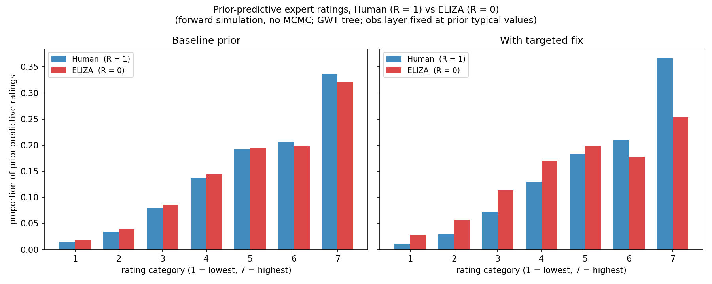
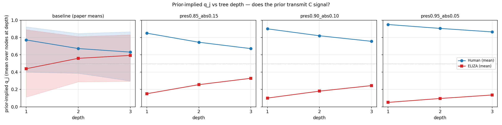
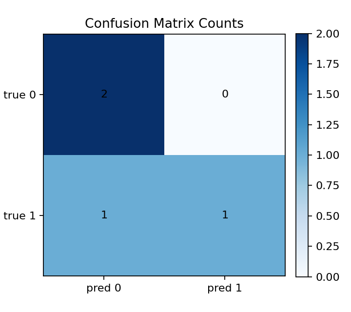
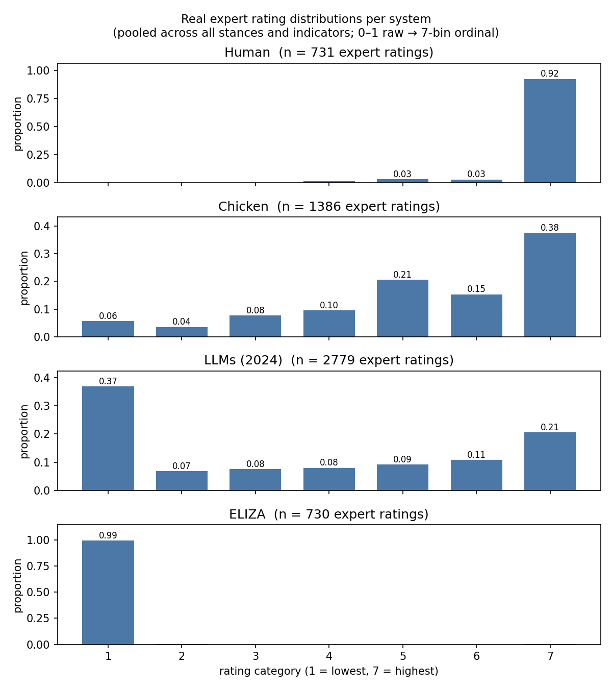
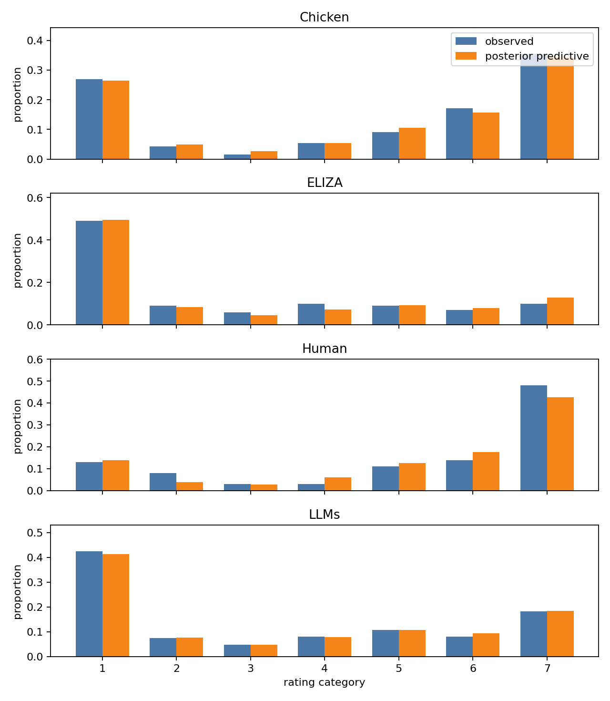

Ryan Kelly

## Headline

A prior issue was preventing the consciousness root from materially affecting the model's expert-rating predictions. A targeted fix moves things in the right direction but is genuinely incremental — even after it, the prior-predictive at the leaf level isn't where we'd want it, and middle-spectrum systems (Chicken, current LLMs) still aren't well-identified.

---

## Where this week landed

The plan was synthetic validation — generate data from the model with a known truth, fit, see whether we recover it. Toy and intermediate setups recover correctly. The full baseline didn't, and on inspection the issues turned out to be upstream of the validation: two prior / structural problems blocking the model from doing what it should. So this talk covers:

- **Issue 1** — the prior wasn't transmitting consciousness to the ratings. Targeted fix in place; recovery looks reasonable on a 10-seed pilot, but the prior-predictive is still worse than I'd want.
- **Issue 2** — even after Issue 1, the binary root + Human / ELIZA-only anchor design can't well-identify $C$ for systems in the middle of the spectrum.

Synthetic validation results exist on the handover branch, but they're more meaningful once Issues 1 and 2 are addressed — synthetic data drawn from a misspecified prior doesn't tell us much about real-data behaviour, and the synthetic dataset itself doesn't resemble the real expert ratings for middle systems (more on that under Issue 2).

**Notation.** $R \in \{0, 1\}$ is the binary root state — the realised "is this system conscious?" outcome at a single draw. $C = P(R = 1)$ is the probability of consciousness — the per-system parameter we're trying to estimate.

---

## Issue 1 — the prior wasn't transmitting consciousness to the ratings

### What's wrong (intuitively)

Even if the model treats Human as conscious ($R = 1$) and ELIZA as not ($R = 0$), under the original priors that signal got diluted travelling down the indicator tree. By the time it reached the leaves, the predicted rating distributions for Human and ELIZA were almost identical — so the root barely changed what experts were predicted to write. In effect, the model said "consciousness doesn't really matter for the ratings."

### Visual — prior-predictive expert rating distributions

Forward simulation only (no MCMC) on the GWT tree, with the observation layer fixed at typical prior values so the $q_j$-driven story is visible. Two systems overlaid per panel: Human ($R = 1$, blue), ELIZA ($R = 0$, red).

Read off:
- **Baseline prior (left).** Human and ELIZA bars are nearly indistinguishable at every category. The model's prior says essentially the same thing about expert ratings whether the system is conscious or not — root signal isn't reaching the leaves.
- **With the targeted fix (right).** Visible separation appears: Human concentrates more at cat 7 (~0.36) while ELIZA shifts down (cat 7 ~0.25, more mass at cats 2–4).

**Honest framing of where this leaves us.** The fix is an improvement in direction but is still incremental. Even in the right panel, the ELIZA distribution doesn't concentrate near the lowest ratings — both systems still lean noticeably high, and they're more similar to each other than I'd want. So this isn't "we've fixed the prior" — it's "we've moved from a prior that essentially ignored consciousness, to one that registers it weakly." A more principled revision (see follow-up) is the natural next step.

Mean prior-implied $q_j$ across the 50 GWT indicators (sanity check):

| Variant | Human ($R = 1$) | ELIZA ($R = 0$) | Gap |
|---|---:|---:|---:|
| Baseline | 0.638 | 0.591 | **0.047** |
| Targeted fix | 0.687 | 0.437 | **0.250** |

### Supporting — $q_j$ vs tree depth

The same story one level upstream of the ratings. $q_j$ is the prior-implied probability that indicator $j$ is in the present state, given root state $R$.

- **Baseline (leftmost panel).** Human (blue) and ELIZA (red) curves converge by depth 3 — root signal collapses with depth. The shaded bands show the spread of $q_j$ across nodes at each depth (different (support, demandingness) labels give different prior $\beta$s).
- **Override panels.** With $\beta_\text{pres}, \beta_\text{abs}$ pushed away from each other to fixed values across all nodes, the curves stay separated at every depth. Bands are absent here only because the override sets every node's $\beta$ to the same value, so $q_j$ has no spread within a depth — not because the override is somehow more certain.

### My fix — targeted, not a blanket prior swap

- **Targeted, not global.** I override only specific lower-edge nodes (`TARGETED_OVERRIDE_NODE_KEYS`) where the prior was bottlenecking transmission, rather than rewriting every $\beta_\text{pres}, \beta_\text{abs}$ in the tree. Each targeted edge gets a logit-Normal prior centred near 1 (presence) or 0 (absence), so $\beta_\text{pres} - \beta_\text{abs}$ stays large enough at those edges to transmit signal.
- **Why targeted matters.** The support / demandingness mapping that produces the existing $\beta$ priors is informed by domain experts, per stance — it's a substantial body of work and I didn't want to override it wholesale just to fix this leak. The targeted overrides are deliberately conservative.
- **Honest take.** This is the minimum-invasive fix that lets recovery work on synthetic data; it isn't the right end-state. The prior-predictive plot above shows the leaf-level behaviour is still poor, and the deeper question — _whether the support / demandingness → $\beta$ translation table itself produces sensible joint prior-predictive behaviour_ — is what I'd want to revisit collaboratively. See the follow-up cell.

### Recovery — 10-seed synthetic check

A brief sanity check on whether the targeted fix actually recovers the truth on synthetic data. We generate 10 synthetic seeds, each with a random root state $R$ drawn per system; for each unanchored system (Chicken, LLMs) the root is randomly $0$ or $1$. We then fit the model and ask: did the posterior put $P(R = 1 \mid \text{data}) > 0.5$ when the truth was $R = 1$, and $< 0.5$ when the truth was $R = 0$? The matrix is over 20 cases (10 seeds × 2 unanchored systems).

- **All 10 truly-absent ($R = 0$) cases recovered correctly.** No false positives.
- **6 of 10 truly-present ($R = 1$) cases recovered correctly.** The 4 misses look like cases where the underlying simulated parameter draw was itself ambiguous, not the inference dropping signal.
- Sampler clean: no divergences, $\hat{R} \approx 1$.

Source: `outputs/main_synthetic_validation_pilot_20260511/pilot_decision_report.md`. Reassuring as a basic sanity check; the more important question for the model is the prior-predictive issue above and Issue 2 below.

### Follow-up — revisit support / demandingness → $\beta$ translation, collaboratively

This is the most important next step on the prior side, and I want to flag it clearly so it doesn't read as me sidelining the existing work.

The targeted fix unblocks transmission, but it patches the symptom. The deeper question is whether the **support / demandingness → Beta($\alpha, \beta$) translation table** itself produces sensible joint prior-predictive behaviour. Each individual prior makes domain sense in isolation; the product across edges is what was off, and the prior-predictive at the leaves (above) shows even the targeted fix isn't where it should be.

I'd like to keep the existing labels and the existing support / demandingness elicitation intact — just revisit how that table maps to Beta priors so that the joint prior-predictive at the rating level matches expert intuition. Ideally with Matilda, given her ownership of this layer.

### Process reflection — Bayesian workflow lens

Reflecting on how I ended up here: the prior-predictive plot above is a quick check that doesn't need any data, and it would have surfaced Issue 1 directly if I'd run it earlier. Gelman et al. 2020, *Bayesian Workflow* (arXiv:2011.01808), Figure 1, places prior-predictive checks early in the workflow for exactly this reason — they catch prior-side mis-specifications before they get tangled up with inference and data-fit questions.

The first phase of this project — the ordinal observation layer plus the product-sum / belief-propagation marginalisation that lets us run NUTS quickly on a normal laptop — was important groundwork, but it's largely orthogonal to the tree-prior issue. Once that fast-iteration loop existed, applying more of the Bayesian workflow systematically (prior-predictive → fake-data → posterior-predictive checks, in that order) is what would have caught Issue 1 sooner. That's the framing I'd use for the remaining time and for the post-SPAR continuation: lean more on the workflow, less on ad-hoc diagnostic chases.

---

## Issue 2 — binary root + extreme references can't well-identify middle systems

### How fixing Issue 1 made this visible

Once root signal actually reaches the indicators, the model effectively has two regimes: $R = 1$ → Human-like ratings, $R = 0$ → ELIZA-like ratings. Middle systems (Chicken, current LLMs) sit empirically between, but the only way the binary root can produce middle-spread behaviour is by mixing those two extreme regimes — so $C$ for these systems ends up only weakly identified. The fit to expert ratings can look fine even when the underlying $C$ is barely constrained.

### Visual — real expert rating distributions per system

Generated this morning from `data_cache.json`, pooled across all stances and indicators.

Read off:
- **Human**: 92% at cat 7. **ELIZA**: 99% at cat 1. Reference anchors sit at the two extremes.
- **Chicken**: spread across the upper-middle — 38% at 7, 21% at 5, 15% at 6, 10% at 4, 8% at 3. _Not_ a high-low bimodal pattern.
- **LLMs (2024)**: most concentrated single category is cat 1 (37%), but every middle category (2–6) carries 7–11% and cat 7 has 21%. Spread broadly across the whole range.

The middle systems genuinely sit between the extremes — and they have substantial mass in middle categories that a binary-root + Human / ELIZA-anchor model can only produce as a probability mixture of the two extreme regimes.

### Aside — and a check on the synthetic validation framework

The previously-shared synthetic-validation plot above shows Chicken and LLMs as roughly bimodal at categories 1 and 7. That apparent bimodality is an artefact of pooling across 10 seeds where the synthetic root $R$ was randomly $0$ or $1$ per seed — when half the seeds have $R{=}1$ (high ratings) and half have $R{=}0$ (low ratings), the pooled distribution looks bimodal even though no single synthetic seed produces the spread-across-the-middle distribution we see in real data.

So the synthetic data the validation has been generating doesn't resemble real expert ratings for middle systems. That's another reason synthetic validation results, in isolation, are limited evidence about real-data behaviour.

### It's not the leaf model

I tested a few alternatives at the leaf — direct-$q$, mixture, and sweeping the number of raters per indicator. None of them lift $C$ identification on Chicken / LLM beyond what the prior already gives. The bottleneck is upstream of the leaf: at the design / structure level (the binary root + only-extreme-anchors design), not at the rating-emission layer.

Worth flagging on this point: some of the posterior-predictive plots I shared in earlier weeks were focused on the rating / ordinal layer, where I was checking that changes I was making to the leaf preserved good behaviour from $q_j$ onwards. Those PPCs looked fine because the rating layer was fine. The issues we now see are upstream of $q_j$ — first in how the tree propagates root information (Issue 1), and now in how the binary root represents systems that genuinely sit between Human and ELIZA. I could have signposted earlier which layer those diagnostics were checking.

### Suggested next steps (modelling)

Roughly in order of leverage and feasibility-this-week.

1. **Continuous $C$ at the root.** Replace the binary $R_s$ with a continuous root probability $C \in [0, 1]$, so middle systems can be fit at intermediate values directly rather than as mixtures of two extreme regimes. Probably the most promising change, and the most actionable in the time remaining — the model spec is well-defined enough that I think I can land a working implementation within the week with a coding agent + a Pro chat for the maths, if the group thinks this is the right direction.
2. **Graded reference systems.** Add anchor systems at intermediate root probabilities (chimpanzee toward the upper end is the most defensible candidate I can think of). _Big asterisk:_ assigning a justifiable reference probability for anything that isn't an extreme is genuinely hard, and likely stance-dependent. Worth recommending in principle, but the implementation cost is mostly in justifying the numbers, not in the model code.
3. **Cross-stance pooling.** Hierarchical structure across stance variants instead of independent per-stance $C_s$ — borrows strength across stances for the same system. Most likely beyond what I can land before SPAR ends, and relevant to Matilda's work on tree structure, so worth flagging as a longer-term direction. _Asterisk:_ any structural change has to remain compatible with the exact-tree (sum-product / belief propagation) algorithm that gives us the marginal likelihood — that means it has to stay a tree (no two-parents → one-child), and very deep structures hurt propagation more than wider ones.
4. **Open question — joint shared tree (current) vs per-system tree (original).** Both have known issues. Per-system has historically had per-system parameters absorb rating-distribution differences without informing $C$. Personally I'm leaning toward sticking with the joint shared tree and trying to make middle systems work via (1) and / or (2), but I'm genuinely unsure — would value group input.

---

## Key Questions

1. **Support / demandingness → $\beta$ translation revisit.** Each individual prior is domain-informed; the joint prior-predictive at the leaf isn't where it should be (see the Issue 1 main visual). I'd like to revisit the translation collaboratively (Matilda especially) — keeping existing labels and elicitation, adjusting only how that table maps into $\beta$ priors. What's the appetite for this and how would you want to scope it?
2. **Joint shared tree vs per-system tree.** For the final report and for the Issue 2 fixes, do we have a settled preference, or is this still open? My lean is joint shared tree + continuous $C$, but I'd rather hear the group's read before committing.

_(Optional, only if it comes up)._ Is there ongoing data-collection / survey-design work where input from this modelling would be useful? Holding off on specific recommendations until Issue 2 is closer to resolved — recommending more raters or particular structures on the basis of the current model would risk validating decisions against a model we know isn't representing middle systems.

## Actions for next week (final SPAR week)

- **Final report.** Main deliverable. Joint with Matilda and Arvo (others as relevant). I'd like to lead / contribute heavily to the writing.
- **Implement leading Issue-2 candidate (continuous $C$).** Feasible within the week if the group endorses it and the spec is clear; happy to prototype this with a coding agent + Pro for the maths.
- **Re-run synthetic validation against the fixed model.** Much more meaningful once Issue 1 + Issue 2 changes are in (and once the synthetic generator is producing data that resembles real expert ratings for middle systems).
- **Real-data fits with the fixed model**, so we have current per-system $C$ numbers to hand off.
- _Open to delegating poster / video to whoever's keen on those — I'd prefer to spend my remaining time on modelling and the report._

## Where the code lives

- Latest snapshot: branch `ryan/spar-handover-2026-05-12` on `github.com/arvomm/dcm-spar`.
- This week's directories of interest: `notebooks/asymmetric_prior_sweep_2026-05-10/`, `notebooks/synthetic_validation_2026-05-06/`, `outputs/main_synthetic_validation/`, `outputs/main_synthetic_validation_pilot_20260511/`. The two plot generators for this notebook live alongside it: `generate_prior_predictive_ratings.py` and `generate_real_observed_ratings.py`.

